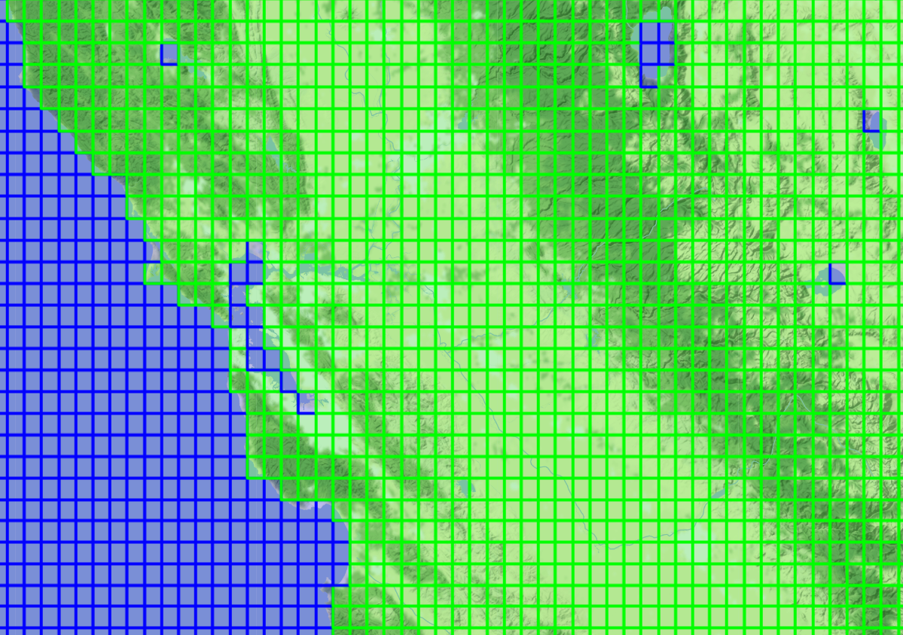
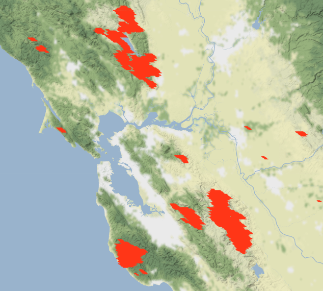
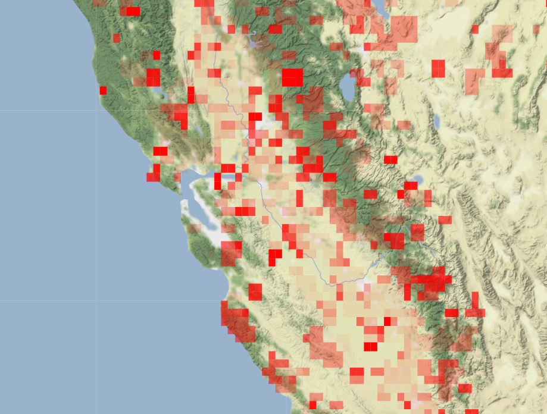

# **Data Collection and Visualizations for Wildfire Risk Prediction**
---
### Sean Nesbit (sfnesbit@calpoly.edu)
### Emily Gavrilenko (egavrile@calpoly.edu)
---
## About

A land area's fire risk assessment is a critical feature of wildfire fighting. This project intends to provide a base to easily estimate fire risk based on climate data colleted by the Global Imagery Browse Service (GIBS) and Google Earth Engine. This climate imagery data provides a window into the many climate features that affect how at risk an area is for fires. With this climate data, we can train a Convolutional Neural Network (CNN) to estimate the susceptibility of an area.  

The end goal is to be able to provide a longitude/latitude bounding box and receive the current estimated risk of fires for each 0.1 by 0.1 (long by lat) area utilizing live climate data. From this we can build a visual tiled risk map of the bounding box or raw data for future uses.

---
## Requirements

### **Google Earth Engine**

 > pip install earthengine-api --upgrade

 Note: you must create a [Google Earth Engine account](https://signup.earthengine.google.com/#!/) to access the APIs.

### **GIBS Downloader**
Follow instructions at [GIBS-Downlaoder GitHub](https://github.com/spaceml-org/GIBS-Downloader) for installation of GDAL and and GIBS downloader

### **Folium**

 > pip install folium

An interactive map for Python. Used for visualizing many of the datapoints collected.

### **Multiprocess**

> pip install multiprocess

For parallelization of tile burn date data collection.

<br>

---

## **Usage**

---

### **[TileBuilder.ipynb](src/TileBuilder.ipynb)**

#### Tiles 0.1 by 0.1 Longitude by Latitude regions across California and Nevada.
Produces 9016 total tiles, of which 6910 are at least 50% land and 2106 are more than 50% water. Each tile contains data stored as:

`( (Longitude: int, Latitude: int), proportionOfWater: float )`

Tiles are saved to newlines in `data/allTiles.txt` `data/landTiles.txt` and `data/waterTiles.txt`. 

**NOTE: TileBuilder.ipynb *must* be ran first as all other notebooks and files require the tiles to be generated!**

[InteractiveMap](outputs/landVsSeaTiles.html)



<br>

---

### **[FireVisualization.ipynb](src/FireVisualization.ipynb)**

Visualizes a single, interactive burn map over the date range given. This map uses the [MODIS Thermal Anomalies/Fire Product](https://modis.gsfc.nasa.gov/data/dataprod/mod14.php) from NASA through [Google Earth Engine FIRMS](https://developers.google.com/earth-engine/datasets/catalog/FIRMS#bands) which has a resolution of 1km.

This map is only used for visualizing and understanding the origin of the burn data.

[Interactive Map](outputs/CZUFireBurnMap.html)



<br>

---

### **[burnDate.py](src/burnDate.py)**

Builds JSON files for burn date data per land tile provided by [TileBuilder.ipynb](src/TileBuilder.ipynb).

Creates a list of date ranges like `[(date1, date2), (date2, date3), (date3, date4), ...]` over the given month range and the given year range. By default, the script will poll 7 day increments from July to October yearly from 2015 to 2020. 

Each date range will produce a JSON file that contains data for each land tile. The tile will contain the starting date of the date range if there was a fire, and will contain null if there was no fire.

JSON files can be read into python as a 2D dictionary and be indexed like: 

`fireData[longitude][latitude] -> None | null` 

Or

`fireData[longitude][latitude] -> "YYYY-MM-DD"`

Where `longitude` and `latitude` are the southwest coordinates of a valid land tile. `None`/`null` corresponds to an area that didn't burn during that date range, and `'YYYY-MM-DD'` is the start date of the current date range if the area burned during the date range (note: will be the same date as provided on the JSON file).

Example: [*fireData-2015-07-01.json*](data/burn/fireData-2015-07-01.json)
```
{
    "dates": [
        "2015-07-01",
        "2015-07-15"
    ],
    "-118.5": {
        "33.3": null,
        "34.0": null,
        "34.1": null,
        "34.2": null,
        ...,
    },
    
    ...
    
    "-117.6": {
        "33.5": null,
        "33.6": null,
        "33.7": null,
        "33.8": null,
        "33.9": "2015-07-01",
        "34.0": "2015-07-01",
        "34.1": null,
        ...,
    },

    ...

}
```


---

### **[BurnDateVisualization.ipynb](src/BurnDateVisualization.ipynb)**

Used to combine [burnDate.py](src/burnDate.py) burn dates and [TileBuilder.ipynb](src/TileBuilder.ipynb) tiles. This visualizes the burned areas across a large date range (July-October, 2015-2020), with more recently burned areas being more opaque. Unlike [FireVisualization.ipynb](src/FireVisualization.ipynb), this visualization is for a *tiled* output over a 0.1x0.1 longitude x latitude rather than the 1sqkm resolution from MODIS.

[Interactive Map](outputs/tiledBurnMap.html)



<br>

---
### **[gibsDownloader.py](src/gibsDownloader.py)**

Combines burn dates from [burnDate.py](src/burnDate.py) and tiles from [TileBuilder.ipynb](src/TileBuilder.ipynb), then downloads climate data images from [Global Imagery Browse Services (GIBS)](https://earthdata.nasa.gov/eosdis/science-system-description/eosdis-components/gibs) using the open source [GIBS Downloader (GDL)](https://github.com/spaceml-org/GIBS-Downloader/blob/main/README.md). 

First, burned tiles are collected and a parallelized download is initiated. The earliest burn date of the tile is found and `7 days` are subracted from the burn date to retrieve the climate data from before the fire. 

Then, unburned tiles are collected and a parallelized download is initiated. For the unburned tiles, a date range (default: *July-October, 2015-2020*) is selected, and a random date is chosen to download the climate data.

Images are stored in `data/climate/burned` or `data/climate/unburned`. Each tile has its own folder in the format `long_lat` where each climate image is stored in subdirectories like `product_lat_long_date-range/original_images/*.{png, jpeg, jpg}`.

**Note: Be sure to run [dataCleaning.py](src/dataCleaning.py) to flatten tile subdirectories and remove tiles without every band present.** 

<br>

---
### **[dataCleaning.py](src/dataCleaning.py)**

Flattens tile subdirectories and removes tiles without every product band (incomplete data). 

Subdirectories will be flattened from `tile/{product}_.../original_images/{product.png}` to `tile/{product.png}`.

After flattening subdirectories, cleaning will ask if you would like to remove tiles directories that do not contain all product bands. This eliminates incomplete data from the dataset.

`dataCleaning.py` has 3 options: `flatten`, `clean`, and `both`. Flatten must occur before cleaning. Flattening and cleaning are always applied to both burned and unburned data.

Once this step is complete, data can be used in the CNN to predict burn risk.

---


